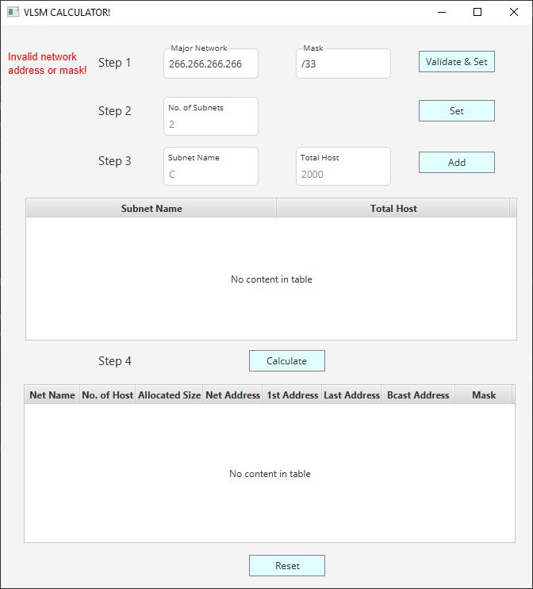
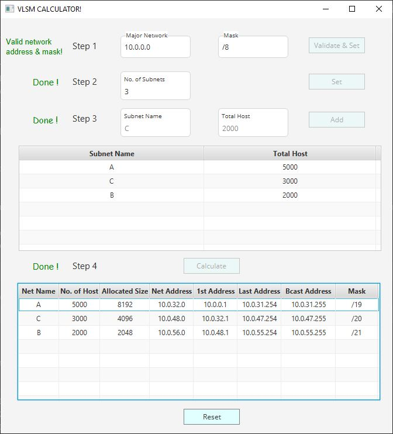

# `VLSM Calculator - JavaFX` 

## Introduction:
VLSM Calculator is a JavaFX desktop application with which we can calculate any types of VLSM subnetting within 4 steps. Each of the subnetting calculation is automatic.   
 
## Screenshots:

## `Home Window`
Main Window  

  
## `Customer`
Calculated VLSM  
   
  
  

## Requirements to Run this project/Jar/Exe file:
<li> Your Java Version Must be 11 or above.</li>
<li> Use build tools Maven </li>  
   

## Things and Tools I Used in this project:
<li> IntellIJ IDE </li>
<li> SceneBuilder 8.5 (for JFoenix 8.0.10 & java 8 compatible) </li>
<li> Java 11 </li>
<li> JavaFX </li>
<li> MaterialFX </li> 

## Contributing
Pull requests are welcome. For major changes, please open an issue first to discuss what you would like to change.
Please make sure to update tests as appropriate.

## License
Distributed under the MIT License. See [License](LICENSE) for more information.
